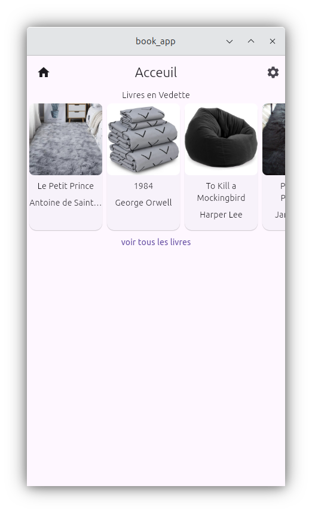
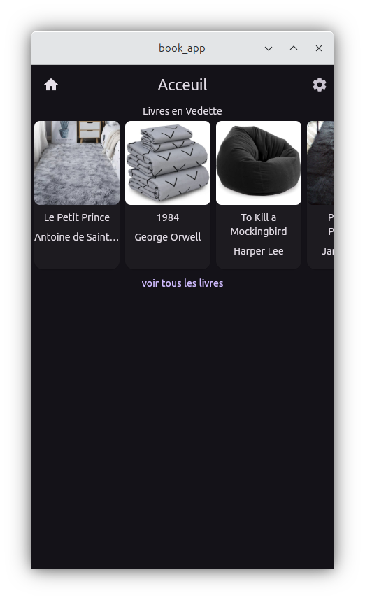
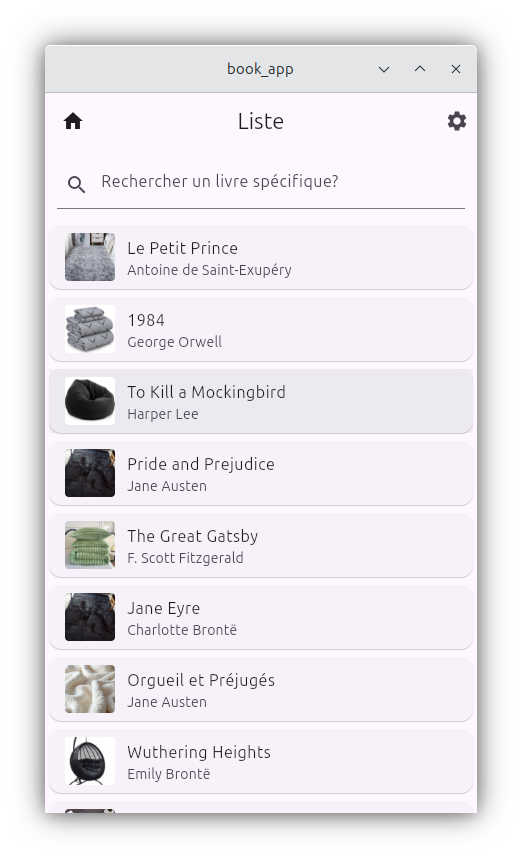
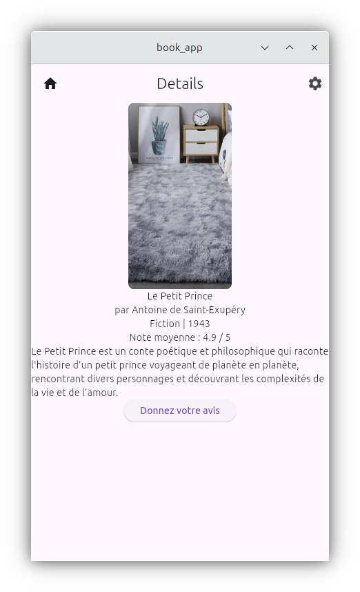
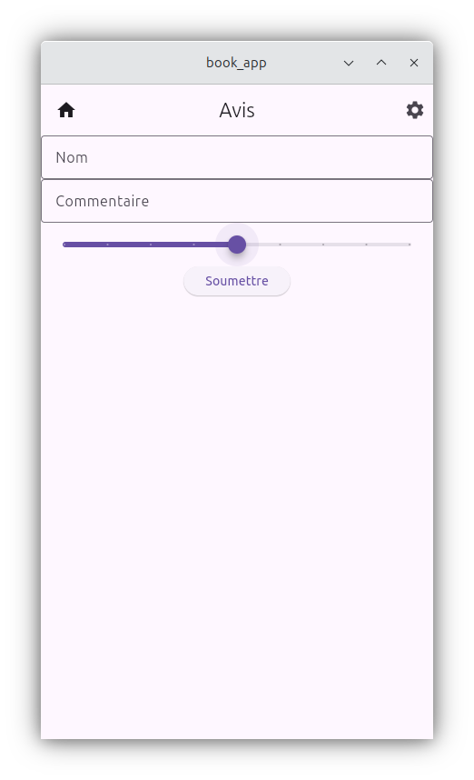
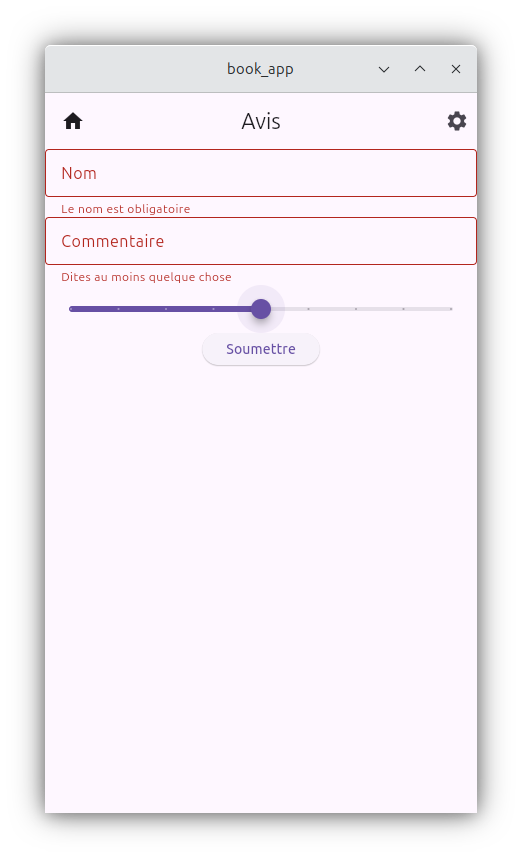
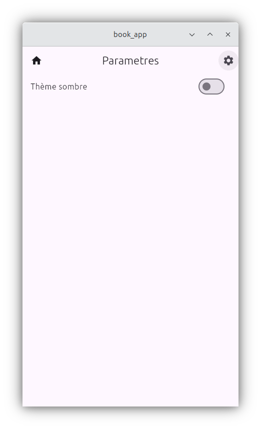
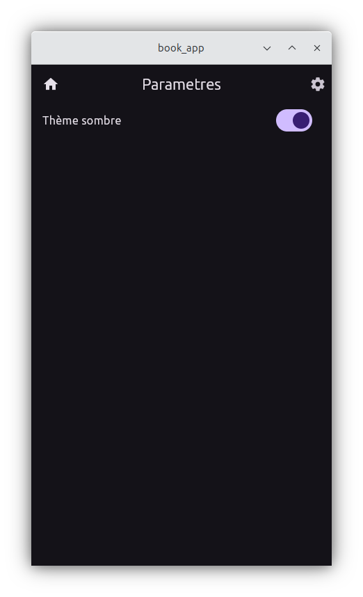

# book_app

## description

Application Flutter multi écrans pour gestion de livres

## Fonctionnalités

-Listes de Livres avec recherche
-Détails d'un livre avec une note moyenne
-Formulaire d'avis
-Theme Sombre/Clair
-Responsive tablette / téléphone

## Instructions de lancement

1. Cloner le repo
2. `flutter pub get`
3. `flutter run`

## captures d'écran

